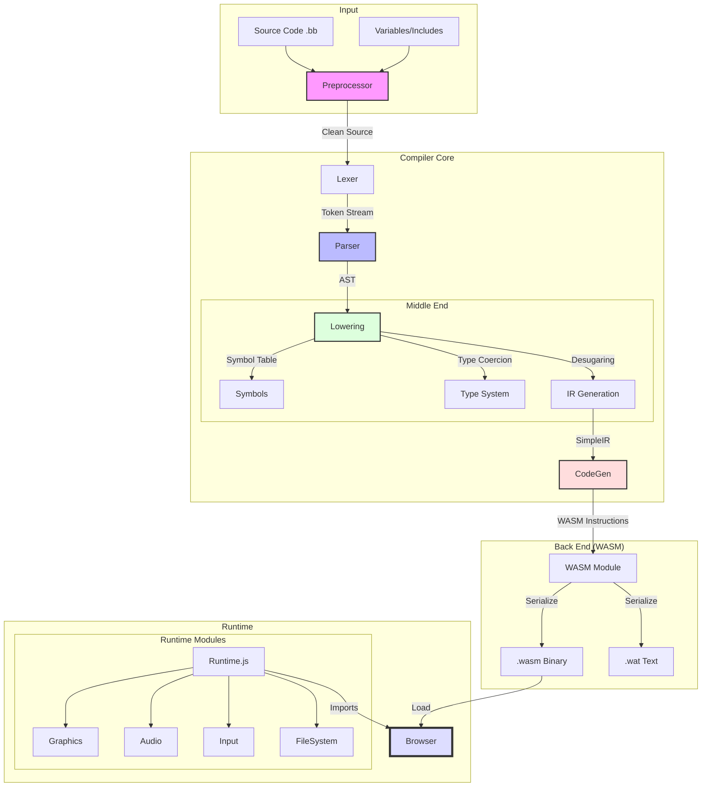

# Compiler Architecture

This diagram illustrates the flow of data through the Blitz3D-to-WASM compiler
pipeline.

## Component Roles

1. **Preprocessor**: Resolves `#Include` paths and normalizes text encoding
   (Windows-1252 -> UTF-8).
2. **Lexer**: Tokenizes the raw text (Identifier, Keyword, Literal).
3. **Parser**: Builds the **Abstract Syntax Tree (AST)**. Validates syntax
   (e.g., `If` must have `EndIf`).
4. **Lowering**: The heavy lifter.
   - **Features**: Type checking, implicit casting (`coerce`), array allocation
     (`__Alloc`), and control flow simplification.
   - **Output**: **Intermediate Representation (IR)**, a simplified, typed
     assembly-like language.
5. **CodeGen**: Translates IR to WebAssembly.
   - **Responsibilities**: Stack management, block/loop depth calculation,
     memory alignment.
6. **Runtime**: JavaScript layer that provides the "Operating System" for the
   game (Rendering, IO, Audio).
