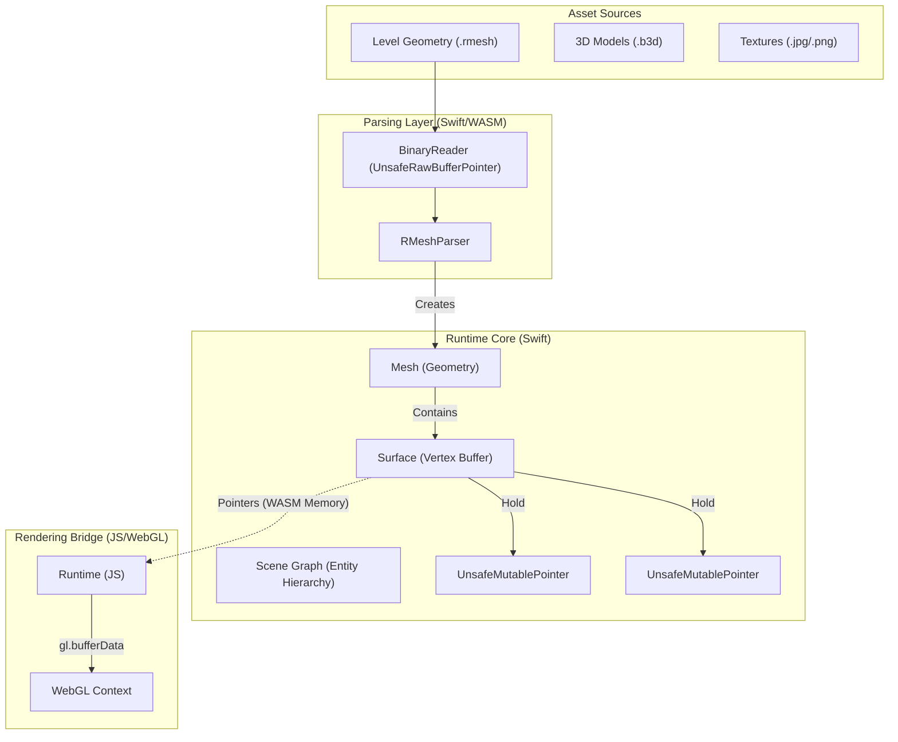
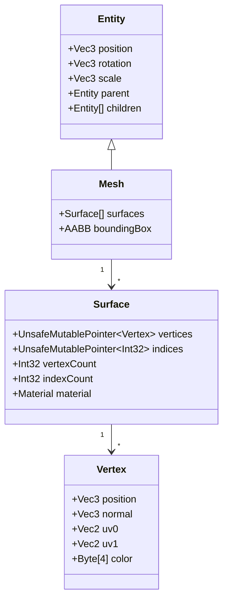
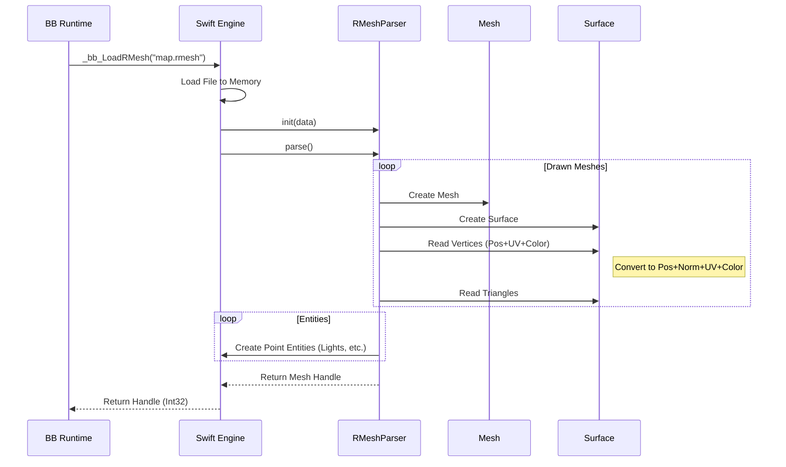

# Asset Pipeline & Mesh System Architecture

## Overview

This document outlines the architecture of the asset pipeline, focusing on how RMesh assets are loaded, parsed, and represented in the Swift-based Blitz3D Runtime.



## Mesh Data Structure

The `Mesh` class is the core geometry container. It mimics the Blitz3D structure but is optimized for WebGL data transfer.



## RMesh Parsing Flow

The parsing process converts the compact, game-specific RMesh format into the runtime's standard `Mesh` format.



## Asset Pipeline: File to GPU

1.  **File Loading:** The file is fetched (via fetch API or embedded FS) into WASM Linear Memory.
2.  **Parsing:** `RMeshParser` reads the raw bytes and populates `Surface` vertex buffers directly in WASM memory.
3.  **Rendering Sync:**
    *   JS Runtime queries the WASM memory address of the Vertex Buffer.
    *   JS creates a `Float32Array` view on that WASM memory.
    *   JS calls `gl.bufferData` to upload it to the GPU.
    *   *Result:* Zero-copy from Parse to Upload (view only).

## Collision Integration

The parsed mesh data is reused for physics.

```mermaid
flowchart TD
    A[Parsed Surface] --> B{Usage}
    B -->|Rendering| C[WebGL VBO]
    B -->|Physics| D[Collision Triangle Soup]
    
    D --> E[Spatial Partitioning (Octree/Grid)]
    E --> F[Collision World]
```
