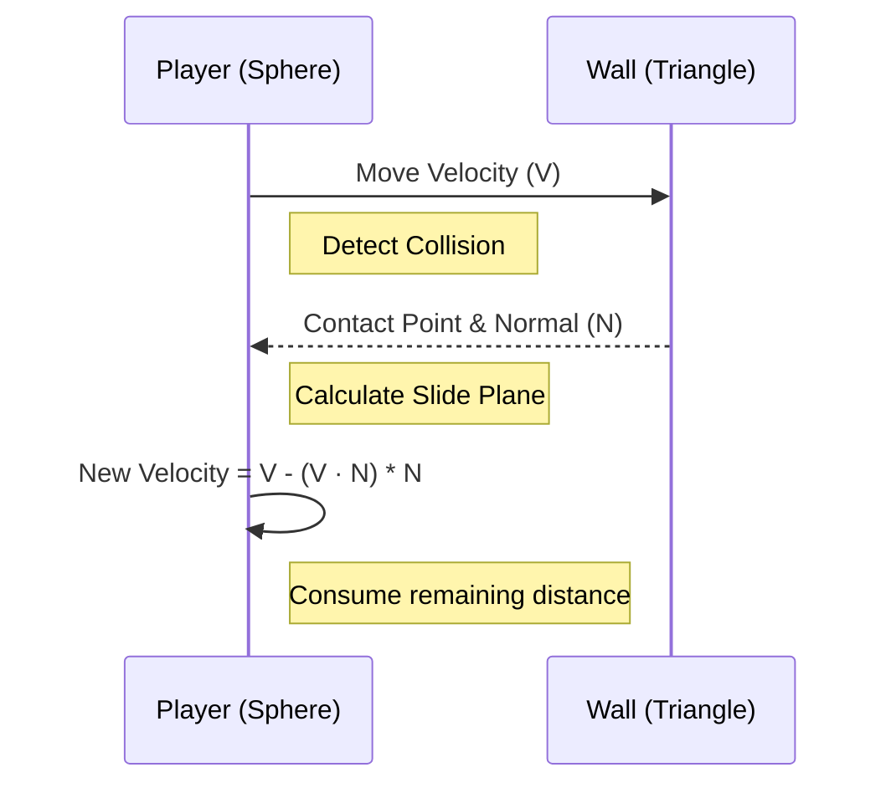

# SCP:CB Physics & Collision System

## Overview

SCP: Containment Breach (SCP:CB) uses Blitz3D's built-in collision system, which implements a specific "Ellipsoid-Space Sliding" algorithm. This system is robust for player movement (sliding along walls, walking up stairs) but simple compared to modern rigid-body physics engines (like Bullet or PhysX).

This document details the algorithm and how we replicate it in the Swift/WASM runtime.

## Core Concepts

### 1. The Ellipsoid Collider
Instead of a capsule or cylinder, Blitz3D represents the player as an **Ellipsoid** defined by a radius vector $(R_x, R_y, R_z)$.

*   **Player:** Typically Radius $(0.15, 0.3, 0.15)$ (approx).
*   **Transformation:** To simplify math, the entire world is scaled by $(1/R_x, 1/R_y, 1/R_z)$ so the player becomes a **Unit Sphere** $(r=1)$. This is "Ellipsoid Space".

### 2. Collision Response: "Sliding"

When the player hits a wall, they don't stop; they "slide" along it. This allows smooth movement through corridors without getting stuck on geometry seams.



### 3. Collision Types (SCP:CB Specifics)

SCP:CB defines specific collision layers (integers) to manage interactions.

| Type ID | Constant | Usage | Method | Response |
| :--- | :--- | :--- | :--- | :--- |
| 1 | `HIT_MAP` | Walls, Floors, Ceilings | Polygon | Slide |
| 2 | `HIT_PLAYER` | The Player | Ellipsoid | Slide |
| 3 | `HIT_ITEM` | Inventory Items | Box/Sphere | Stop |
| 4 | `HIT_APACHE` | (Legacy/Unused) | - | - |

**Setup Code (Blitz3D):**
```blitzbasic
Collisions HIT_PLAYER, HIT_MAP, 2, 2  ; Sphere-to-Poly, Slide
Collisions HIT_PLAYER, HIT_ITEM, 2, 1 ; Sphere-to-Poly, Stop
```

## The Algorithm (Step-by-Step)

The `CollisionWorld.update()` function performs recursive collision resolution.

```mermaid
flowchart TD
    Start([Frame Start]) --> Gravity[Apply Gravity to Velocity]
    Gravity --> Attempt1[Attempt Move (Velocity)]
    
    Attempt1 --> Check{Collision?}
    Check -->|No| Move[Move Player]
    Move --> End([Frame End])
    
    Check -->|Yes| Resolve[Calculate Sliding Plane]
    Resolve --> Project[Project Velocity onto Plane]
    Project --> PushOut[Push out by EPSILON]
    PushOut --> Attempt2[Attempt Move (New Velocity)]
    
    Attempt2 --> CheckRecursion{Recursion < 5?}
    CheckRecursion -->|Yes| Check
    CheckRecursion -->|No| Stop[Stop Movement]
```

### 1. Detection
*   Convert Triangle to "Ellipsoid Space" (Scale vertices).
*   Check intersection between Unit Sphere (at origin relative to sweep) and Triangle.
*   **Sweep Test:** We don't just check static overlap; we check the *swept volume* of the sphere moving along the velocity vector to prevent tunneling (bullet-through-paper).

### 2. Response (The "Slide")
Given a collision normal $\hat{n}$ and velocity $\vec{v}$:

$$
\vec{v}_{new} = \vec{v} - (\vec{v} \cdot \hat{n}) \hat{n}
$$

This removes the component of velocity moving *into* the wall, keeping the component *parallel* to it.

### 3. Gravity Handling
Gravity is just a constant downward force added to velocity every frame. The sliding algorithm naturally handles slopes:
*   **Flat floor:** Normal is $(0, 1, 0)$. Gravity $(-y)$ is perpendicular. Sliding vector is zero (stops falling).
*   **Slope:** Normal is angled. Gravity component slides player down the slope.

## Implementation in Swift

We implement this in `Sources/Blitz3DEngine/Physics/Collision.swift`.

### Data Structures

```swift
struct CollisionPacket {
    var r3Position: Vec3      // Ellipsoid space position
    var r3Velocity: Vec3      // Ellipsoid space velocity
    var eRadius: Vec3         // Ellipsoid radii
    
    var foundCollision: Bool
    var nearestDistance: Float
    var intersectionPoint: Vec3
}
```

### Recursion Loop
```swift
func collideAndSlide(position: Vec3, velocity: Vec3, radius: Vec3) -> Vec3 {
    // 1. Convert to e-space
    var planeSpacePos = position / radius
    var planeSpaceVel = velocity / radius
    
    // 2. Recursive slide (max 5 iterations)
    for _ in 0..<5 {
        let collision = checkCollisions(planeSpacePos, planeSpaceVel)
        if !collision.found {
            planeSpacePos += planeSpaceVel
            break
        }
        
        // 3. Respond
        let newDest = position - (velocity.normalized * epsilon) // Snap back
        let slidePlaneNormal = collision.normal
        
        // Project velocity
        planeSpaceVel = planeSpaceVel - slidePlaneNormal * dot(planeSpaceVel, slidePlaneNormal)
    }
    
    // 4. Convert back
    return planeSpacePos * radius
}
```

## Differences from Modern Physics (e.g., Box2D/Bullet)
*   **No Rotation:** The player collider does not rotate (it's axis-aligned).
*   **No Momentum/Mass:** Movement is purely kinematic. Velocity is set directly, not by applying forces (F=ma).
*   **Mesh-Based:** Collides directly with raw triangle meshes (RMESH), not simplified convex hulls. This makes it expensive but accurate for complex level geometry.
