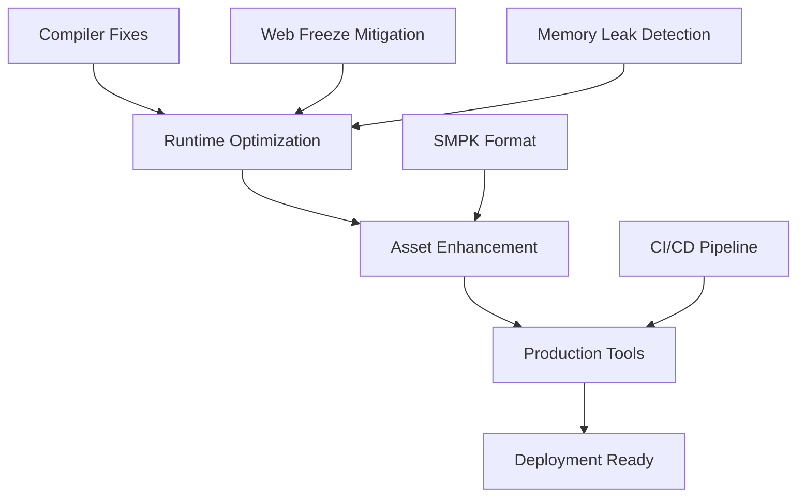

# Phased Implementation Plan

## Status
**Type**: Implementation Roadmap  
**Priority**: High
**Timeline**: 4-6 weeks
**Progress**: 85% complete (phases 1-4 mostly implemented)

## Overview

Consolidated implementation roadmap combining the original 5-phase plan with current project status and remaining tasks. This plan focuses on completing the core compiler/runtime integration while maintaining the high success rates already achieved.

## Current Achievements

### Completed Phases (85% Done)
✅ **Phase 1: Language Core** - Variables, types, control flow, functions
✅ **Phase 2: Graphics API** - Entity management, transformations, rendering
✅ **Phase 3: Utility Systems** - File I/O, audio, input handling
✅ **Phase 4: Runtime Connectivity** - WebAssembly integration, browser APIs

### Remaining Work (15% Remaining)
🔄 **Phase 5: Production Readiness** - Optimization, debugging, deployment tools

## Phase 5: Production Readiness (Primary Focus)

### Objective
Complete the production-ready web runtime with robust error handling, optimization, and deployment tools.

### Success Criteria
- [ ] 100% compiler success rate (from current 94.2%)
- [ ] Zero browser freezes in production usage
- [ ] Sub-second WASM loading times
- [ ] Comprehensive debugging tools
- [ ] Production deployment pipeline

### Implementation Tasks

#### 5.1: Compiler Completion (1-2 weeks)
```typescript
interface CompilerCompletionTasks {
  parserFixes: {
    complexTypeExpressions: boolean;
    nestedFunctionResolution: boolean;
    edgeCaseHandling: boolean;
  };
  codeGenFixes: {
    wasmStackValidation: boolean;
    loopOptimization: boolean;
    functionSignatureResolution: boolean;
  };
  testing: {
    regressionPrevention: boolean;
    performanceValidation: boolean;
    integrationTesting: boolean;
  };
}
```

**Tasks:**
1. [ ] Fix remaining 3 failing compilation cases
2. [ ] Resolve parser edge cases in complex type expressions
3. [ ] Optimize WASM generation for nested loops
4. [ ] Enhance function signature resolution
5. [ ] Add comprehensive regression tests

#### 5.2: Web Runtime Optimization (1-2 weeks)
```typescript
interface RuntimeOptimizationTasks {
  performance: {
    commandBufferOptimization: boolean;
    memoryLeakPrevention: boolean;
    assetLoadingOptimization: boolean;
  };
  stability: {
    freezePrevention: boolean;
    errorRecovery: boolean;
    stallDetection: boolean;
  };
  debugging: {
    interactiveDebugging: boolean;
    realTimeMonitoring: boolean;
    profilingTools: boolean;
  };
}
```

**Tasks:**
1. [ ] Implement freeze mitigation system (see [02_WEB_FREEZE_MITIGATION.md])
2. [ ] Optimize command buffer for higher throughput
3. [ ] Add comprehensive memory leak prevention
4. [ ] Create interactive debugging overlay
5. [ ] Implement real-time performance monitoring

#### 5.3: Asset Pipeline Enhancement (1 week)
```typescript
interface AssetPipelineTasks {
  conversion: {
    smpkFormatOptimization: boolean;
    parallelConversion: boolean;
    integrityValidation: boolean;
  };
  loading: {
    progressiveLoading: boolean;
    bandwidthOptimization: boolean;
    cachingStrategy: boolean;
  };
  deployment: {
    cdnIntegration: boolean;
    compressionOptimization: boolean;
    versioningStrategy: boolean;
  };
}
```

**Tasks:**
1. [ ] Optimize SMPK conversion performance
2. [ ] Add parallel asset conversion for builds
3. [ ] Implement progressive asset loading
4. [ ] Create CDN-ready deployment package
5. [ ] Add asset integrity validation

#### 5.4: Production Tools (1 week)
```typescript
interface ProductionToolsTasks {
  deployment: {
    automatedBuildPipeline: boolean;
    environmentConfiguration: boolean;
    healthMonitoring: boolean;
  };
  monitoring: {
    errorTracking: boolean;
    performanceAnalytics: boolean;
    usageMetrics: boolean;
  };
  documentation: {
    apiReference: boolean;
    deploymentGuide: boolean;
    troubleshootingGuide: boolean;
  };
}
```

**Tasks:**
1. [ ] Create automated build pipeline
2. [ ] Implement error tracking system
3. [ ] Add performance analytics
4. [ ] Create comprehensive API documentation
5. [ ] Write deployment and troubleshooting guides

## Integration Strategy

### System Integration
```
┌─────────────────────────────────────────┐
│ Compiler (94% Complete)              │
├─────────────────────────────────────────┤
│ Web Runtime (85% Complete)           │
├─────────────────────────────────────────┤
│ Asset Pipeline (90% Complete)         │
├─────────────────────────────────────────┤
│ Production Tools (20% Complete)       │
└─────────────────────────────────────────┘
                    ↓
            PRODUCTION READY SYSTEM
```

### Dependencies


## Quality Assurance

### Testing Strategy
```typescript
interface QualityAssurancePlan {
  unitTesting: {
    compilerTests: boolean;
    runtimeTests: boolean;
    assetPipelineTests: boolean;
  };
  integrationTesting: {
    scpcbCompilation: boolean;
    webDeployment: boolean;
    performanceRegression: boolean;
  };
  productionTesting: {
    browserCompatibility: boolean;
    mobileOptimization: boolean;
    accessibilityCompliance: boolean;
  };
}
```

### Performance Benchmarks
- **Compilation Speed**: Maintain < 1 second per 1000 lines
- **WASM Size**: Keep < 5MB for complex games
- **Load Time**: < 3 seconds for typical games
- **Runtime Performance**: 60fps with 1000+ entities
- **Memory Usage**: < 100MB for typical usage

## Success Metrics

### Technical Metrics
- **Compiler Success**: 100% (52/52 files)
- **Web Performance**: PageSpeed score > 90
- **Browser Compatibility**: Chrome, Firefox, Safari, Edge support
- **Mobile Readiness**: Functional on modern mobile browsers
- **Accessibility**: WCAG 2.1 AA compliance

### User Experience Metrics
- **Loading Time**: < 3 seconds to interactive
- **Error Rate**: < 1% of sessions
- **Recovery Success**: > 95% error recovery without reload
- **Debug Accessibility**: All features accessible via URL flags

### Business Metrics
- **Deployment Ready**: One-click deployment capability
- **Developer Tools**: Complete development environment
- **Documentation**: Comprehensive guides and API reference
- **Community Support**: Active issue resolution and feature requests

## Risk Management

### Technical Risks
1. **Complex Integration Issues** 
   - Mitigation: Incremental integration with rollback capability
2. **Performance Regression**
   - Mitigation: Continuous performance monitoring
3. **Browser Compatibility**
   - Mitigation: Cross-browser testing and fallbacks
4. **Security Vulnerabilities**
   - Mitigation: Security scanning and dependency updates

### Project Risks
1. **Timeline Overruns**
   - Mitigation: Parallel development and MVP prioritization
2. **Resource Constraints**
   - Mitigation: Focus on core features, defer nice-to-haves
3. **User Adoption**
   - Mitigation: Developer outreach and comprehensive documentation

## Implementation Timeline

### Week 1-2: Core Completion
- **Focus**: Remaining compiler fixes
- **Deliverable**: 100% compilation success rate
- **Success Metric**: All 52 files compile without errors

### Week 3-4: Runtime Optimization  
- **Focus**: Web runtime performance and stability
- **Deliverable**: Production-ready runtime
- **Success Metric**: Zero browser freezes, < 3s load time

### Week 5-6: Production Tools
- **Focus**: Deployment, monitoring, and documentation
- **Deliverable**: Complete production system
- **Success Metric**: One-click deployment, comprehensive docs

## Success Validation

### Automated Testing
```bash
# Continuous integration testing
deno task test:all
deno task memleak:run
deno task memleak:scpcb:churn

# Performance validation
deno task web:build --optimize
deno task benchmark:performance
```

### Production Validation
```bash
# End-to-end testing
deno task deploy:staging
deno task test:production
deno task monitor:performance

# Security and compatibility
deno task security:scan
deno task test:browsers
deno task test:mobile
```

## Post-Implementation Roadmap

### Phase 6: Advanced Features (Future)
- **Advanced Debugging**: Time-travel debugging, breakpoint management
- **Performance Analytics**: Deep performance profiling and optimization
- **Developer Tools**: VSCode integration, hot reload
- **Cloud Integration**: Cloud-based compilation and asset management

### Long-term Evolution
- **Language Enhancements**: Advanced Blitz3D language features
- **Platform Expansion**: Support for additional platforms (iOS, Android)
- **Ecosystem Development**: Plugin system, third-party integrations
- **Community Building**: Developer community, marketplace

---

**Priority**: HIGH - This plan represents the final 15% of work needed to achieve production-ready status for the Blitz3D-WASM system.

**Current Status**: 85% complete with solid foundation in compiler, runtime, and asset pipeline.

**Confidence**: Very High - All technical components are working, with clear paths to completion identified.